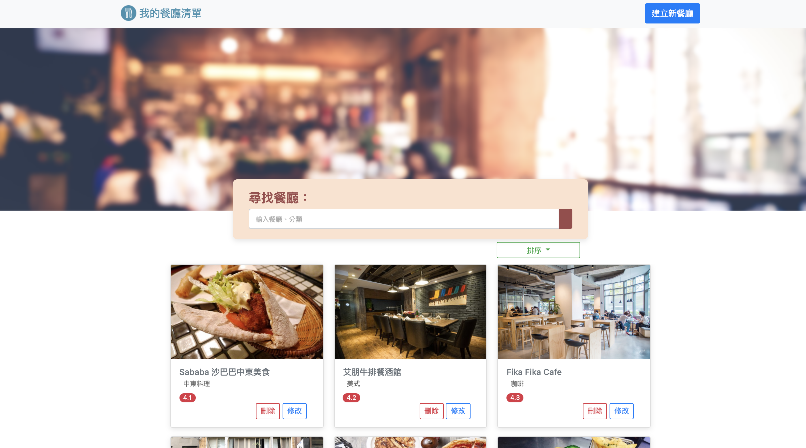

# 餐廳列表

一個使用 Node.js + Express 打造的餐廳美食網站，此專案提供使用者查看餐廳訊息，並可透過餐廳名稱尋找餐廳資訊，例如:餐廳類別、地址、評分、描述等

## 安裝方式
- 將專案clone到本地端
`https://github.com/calvinsungvin/restaurant_lists.git`
- 進入專案資料夾，並下載package
`cd restaurant_lists` &
`npm install`
- 透過nodemon啟動專案
`npm run dev`
- 在terminal可以看到 Express is listening on localhost : 3000，開啟瀏覽器在網址列輸入localhost:3000

## 網站功能
1. 點選首頁任一家餐廳，可以看到更多細節
2. 搜尋餐廳之功能
3. 增加餐廳之功能
4. 修改餐廳資訊之功能
5. 刪除餐廳之功能

## 開發環境
Node.js: v10.15.0 /
Express: v4.17.1 /
Express-Handlebars: v4.0.4

## 截圖
